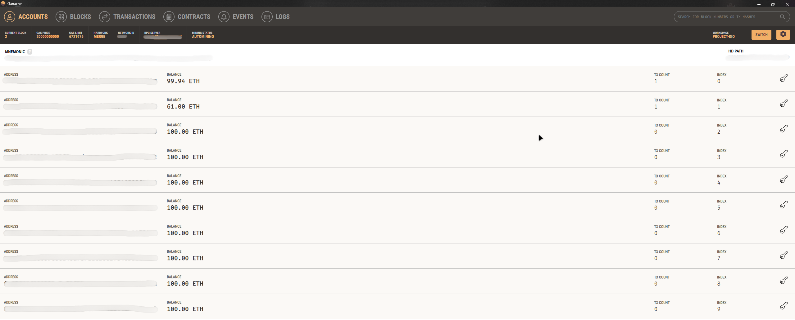

<!-- Projeto Finalizado -->
# Desafio DIO: Minha Primeira Criptomoeda

  

## Objetivo do Projeto

Este projeto implementa um token ERC-20 chamado **Dio Token**. O objetivo é fornecer uma implementação básica de um token ERC-20 utilizando Solidity.

## Tecnologias Empregadas

- **Solidity**: Linguagem de programação para contratos inteligentes na Ethereum.
- **Ganache**: Ferramenta para criar uma blockchain local para testar contratos inteligentes.
- **MetaMask**: Carteira de criptomoedas que permite interagir com a rede Ethereum e seus contratos.
- **Remix IDE**: Ambiente integrado para criar, testar e implantar contratos inteligentes na Ethereum.
- **Truffle**: Framework para contratos inteligentes, facilitando a escrita, teste e implantação de contratos Ethereum.

## Funcionalidades

- **Transferência de Tokens**: Permite a transferência de tokens entre endereços usando a função `transfer`.
- **Aprovação e Transferência de Tokens**: Permite que um endereço aprove outro para gastar uma quantidade específica de tokens e transferir esses tokens usando a função `transferFrom`.
- **Consulta de Saldo e Permissão**: Consulta o saldo de tokens de um endereço usando a função `balanceOf` e o quanto um endereço pode gastar em nome de outro usando a função `allowance`.

## Contrato DioToken

- **Nome do Token**: `Dio Token`
- **Símbolo do Token**: `DIO`
- **Casas Decimais**: `18`

## Interface IERC20

A interface `IERC20` define as funções e eventos obrigatórios para um token ERC-20, incluindo:

- `totalSupply()`: Retorna o total de tokens emitidos.
- `balanceOf(address account)`: Retorna o saldo de tokens de um endereço.
- `allowance(address owner, address spender)`: Retorna a quantidade de tokens que um spender pode gastar em nome do owner.
- `transfer(address recipient, uint256 amount)`: Transfere tokens para outro endereço.
- `approve(address spender, uint256 amount)`: Aprova um spender a gastar uma quantidade específica de tokens.
- `transferFrom(address sender, address recipient, uint256 amount)`: Transfere tokens de um endereço para outro usando permissão prévia.

## Guia de Implementação Resumido

1. **Configuração do Ambiente**
   - **Ganache**: Crie uma rede local Ethereum.
   - **MetaMask**: Conecte-se à rede do Ganache.
   - **Remix IDE**: Use o Remix para compilar e implantar o contrato.
   - **Truffle**: Instale o Truffle e crie um novo projeto com `truffle init`.

2. **Implementação do Contrato**
   - Insira e compile o contrato `DioToken` no Remix.
   - Configure e compile o contrato com o Truffle.
   - Ajuste `truffle-config.js` para conectar ao Ganache.
   - Implemente o contrato com `truffle migrate`.

3. **Interação com o Contrato**
   - Use o Remix ou Truffle Console para interagir e realizar transações de teste com o contrato.

## Contribuição

Contribuições são bem-vindas! Sinta-se à vontade para abrir issues ou fazer um fork do repositório e enviar pull requests.

1. Faça um fork do projeto.
2. Crie uma nova branch para sua feature `git checkout -b feature/nome-feature`.
3. Commit suas mudanças `git commit -m 'Adiciona nova feature'`.
4. Envie para a branch `git push origin feature/nome-feature`.
5. Abra um Pull Request.

## Nota

Este projeto é para fins educacionais, feito para o desafio da **DIO**. Sinta-se livre para explorar e adaptar.
